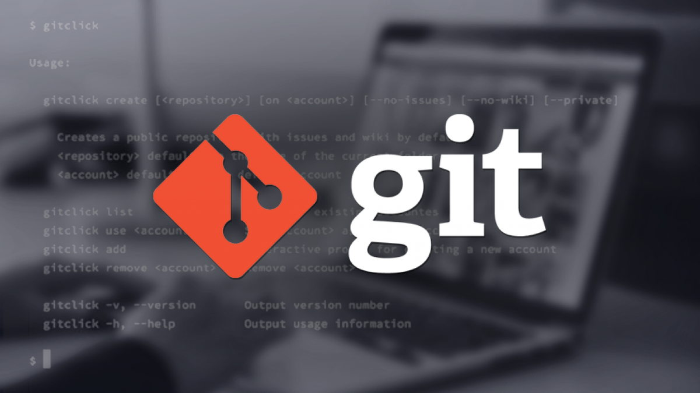

# Инструкция по работе с git

Для создания локального репозитория нужно запустить команду :
> git init

Для добавления файла к следующему коммиту:
> git add

и фиксируем эти файлы:
> git commit

Для отслеживания состояния репозитория, можно ввести команду:
> git status

Чтобы просмотреть все кокоммиты:
> git log

Для просмотра разницы между закоммичанными и текущими изменениями:
> git diff

Для перехода к прошлым коммитам ( с кодом commit_code) можно использовать:
> git checkout commit_code

и чтобы вернуться:

> git checkout master

Для просмотра всех веток:
>git branch

Чтобы создать ветку, нужно:
 >git branch branch_name

Для того, чтобы удалить ветку branch_name, нужно написать:
>git branch -d branch_name

Для совмещения текущей ветки с веткой branch_name:
> git merge branch_neme

Для перехода к ветке branch_name:
> git checkout branch_name

Для вставки изображений в документ нужно ввести:

> ! знак, в [ ] скобках указать альтернативный текст, в ( ) скобках относительный путь изображения.

